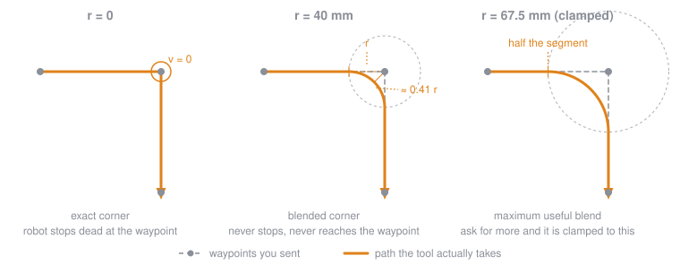

# 02 — Robotic Drawing

> Taking the curves you generated in Python and drawing them for real, with a UR robot holding a pen.
>
> Slides: [📽️ Robotic Drawing](https://docs.google.com/presentation/d/13Lvzf1q7SYPSXNzXdss-Tyasd8IxFwGomVT1s5VIF-0/edit?slide=id.p1#slide=id.p1)

The robot is not a printer. It has mass, it accelerates, it cuts corners, and it will happily drive a pen through a sheet of paper if you ask it to. Most of this page is about the gap between the curve you drew on screen and the line that ends up on the paper — that gap is where the interesting work of the week lives.

## What is in this folder

| File | What it does |
| --- | --- |
| [101_move_robot_urscript.ghx](101_move_robot_urscript.ghx) | The "hello robot" definition — build a couple of target planes, generate URScript, send it |
| [201_robot_workspace.ghx](201_robot_workspace.ghx) | Check that your drawing actually fits inside the robot's reach before you get attached to it |
| [202_robot_painting.ghx](202_robot_painting.ghx) | The full drawing pipeline: curves → planes → blended motion → socket |
| [src/simple_ur_script.py](src/simple_ur_script.py) | Wraps URScript commands. Takes Rhino planes, returns script strings |
| [src/simple_comm.py](src/simple_comm.py) | Opens a TCP socket to the robot and sends the script. Also reads the robot's state back |
| [src/utils.py](src/utils.py) | Transformations between Rhino space and robot base space, blend radius helper |

## How the pipeline works

```
Rhino curve  →  list of planes  →  URScript strings  →  one big script  →  socket :30002  →  robot
                 (utils.py)        (simple_ur_script)  (concatenate_script)  (send_script)
```

Every plane becomes one `movel` line. The whole thing is wrapped in a single `def my_script(): ... end` block and pushed down one socket in one go. There is no feedback loop and no error recovery: once the script is sent, the robot executes all of it.

## ⚠️ Three things that will bite you

### 1. Rhino must be in millimetres

[`move_l`](src/simple_ur_script.py#L34) divides plane origins by 1000 to convert mm → m, because URScript poses are in metres. If your Rhino file is in metres, every target ends up 1000× too close to the robot base, and the robot does something alarming rather than something usefully wrong.

**Check your units before anything else.** `DocumentProperties` → `Units` → `Millimeters`.

### 2. Speed and acceleration are silently clamped

```python
MAX_ACCEL = 3      # m/s²
MAX_VELOCITY = 4   # m/s
```

Anything above these is quietly reduced to the limit — no warning, no message. If your "faster" setting changes nothing, this is why. For drawing you want to be nowhere near these numbers anyway: start at `v = 0.05`, `a = 0.3` and work up.

### 3. The script has a size limit

[`send_script`](src/simple_comm.py#L55) refuses anything over 512 KB with `Program too long`. At roughly 70 characters per `movel` line that is somewhere around 7000 points — and the controller will already be struggling well before that.

A curve divided into 5000 points is not a better drawing than the same curve divided into 400. Resample before you send:

```python
# in Grasshopper, before generating planes
params = curve.DivideByLength(segment_length, True)   # even spacing, controlled count
```

Rule of thumb: divide by **length**, not by count, and pick a segment length around 2–5 mm for pen work. You then get consistent point density whether the curve is 10 cm or 3 m long.

## Blend radius

This is the single most important idea of the session.

`movel` with `r = 0` means *arrive exactly at this waypoint*, which also means *come to a complete stop*. A path of 400 waypoints with `r = 0` is 400 full stop-and-go cycles: it takes forever, and every stop shows up on the paper as a blob of ink.

The blend radius says "you may start turning toward the next target once you are within `r` of this one". The robot never reaches the waypoint, and never stops.



Three things to take from the diagram:

- **The tool never touches a blended waypoint.** It leaves the incoming segment at distance `r` and rejoins the outgoing one at distance `r`. For a right-angle corner the path misses the corner by about `0.41 × r`.
- **Bigger `r` = smoother and faster = less like your drawing.** This is a dial between fidelity and motion quality, and there is no correct setting — it depends on whether you want a crisp polygon or a flowing line.
- **`r` is clamped to half the segment length** by [`calculate_blend_radius`](src/utils.py#L11). Blend spheres of neighbouring waypoints are not allowed to overlap, so on a densely sampled curve your *point spacing* caps the blend, not the number you typed.

That last point is the one that confuses people: if your points are 2 mm apart, asking for `r = 10` gets you `r = 1`. If you want a genuinely smooth line, use fewer points further apart with a larger blend — not more points.

### Try this

Draw the same square four times, at `r = 0`, `2`, `10` and `40` mm. Time each one. Look at the corners. It takes ten minutes and explains the whole concept better than any description.

## Physical setup

**Use a spring-loaded pen holder.** Not optional. A rigidly mounted pen plus a table that is not perfectly flat, or a paper plane that is 2 mm off, gives you torn paper on one side of the sheet and no ink on the other. A compliant mount absorbs 3–5 mm of error and turns an impossible calibration problem into an easy one.

**Probe the paper, do not trust the model.** Jog the robot to three corners of the sheet, record the positions, and build your drawing plane from those. The CAD model of the table is not where the table is.

**Set an explicit pen-up height.** 20–30 mm above the drawing plane, with a `movel` up, across, and back down between strokes. Forgetting this draws a line between every stroke, and is the most common way to ruin a good composition.

**Check reach first.** Open `201_robot_workspace.ghx` before you commit to a composition. A drawing that reaches past the workspace edge will stop mid-line with a protective stop, or flip the wrist through a singularity in the middle of a stroke.

## ✅ Before you press play

- [ ] Rhino document units are **millimetres**
- [ ] Drawing fits inside the workspace (`201_robot_workspace.ghx`)
- [ ] TCP is set for the pen you are actually holding
- [ ] Drawing plane built from probed points, not from the model
- [ ] Pen-up moves between every stroke
- [ ] Point count is sane (hundreds, not thousands)
- [ ] **Dry run**: whole script offset 30 mm above the paper, speed at 10%, no pen
- [ ] Everyone knows where the emergency stop is, and someone has a hand near it

Run the dry run every single time. Not as a formality — it is the only chance you get to see the whole path before it is committed to material.

## Troubleshooting

| Symptom | Likely cause |
| --- | --- |
| `Cannot connect to <ip> 30002` | Robot not in remote control mode, wrong IP, or you are not on the robot's network |
| `Program too long` | Too many points — resample the curve with `DivideByLength` |
| Robot moves somewhere strange immediately | Rhino units are not mm, or the base plane transform is wrong |
| Motion is jerky and slow | `r = 0` everywhere. Add a blend radius |
| Corners are rounded off too much | Blend radius too large relative to your detail size |
| Line pressure varies across the sheet | Drawing plane not parallel to the paper — probe it again, and use a sprung pen |
| Nothing happens, no error | Script sent but the program is not running — check the pendant |
| Speed setting has no effect | You are above `MAX_VELOCITY` / `MAX_ACCEL` and being clamped |

## Going further

- **Universal Robots Script Manual** — the authoritative reference for `movel`, `movep`, `movec` and exactly how blending behaves. Worth skimming once.
- [**vpype**](https://github.com/abey79/vpype) — a plotter path optimiser. Sorts, merges and simplifies line work before you generate motion. Cuts point counts dramatically and removes wasted travel.
- [**compas_fab**](https://compas.dev/compas_fab/) — ETH's own robotic fabrication library. Where you go next for inverse kinematics, planning and collision checking.
- **Artists to look at** — Sougwen Chung (*Drawing Operations*), Patrick Tresset (*Paul the Robot*), Harold Cohen (*AARON*), Vera Molnár and Manfred Mohr for the plotter drawing canon, Jean Tinguely's *Métamatics* for the chaotic version.

---

### The interesting part

Everything above is about making the robot draw what you asked for. The more interesting question is what happens when you stop asking it to be accurate: crank the speed and the blend radius until it overshoots, hang a 40 cm floppy brush off the flange, draw on a curved surface no flatbed plotter could reach. The machine's own dynamics become the material. That is the reason to use a six-axis arm rather than an AxiDraw.
